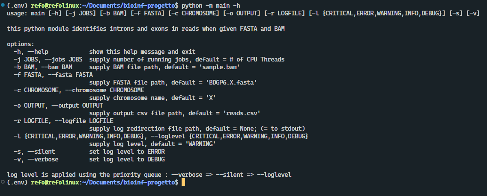

# bioinf-progetto

## Task

### IT

Prendere in input un file in formato BAM che contiene gli allineamenti rispetto a un reference e il file in formato FASTA che contiene il reference stesso. Si richiede di produrre in output i reads spliced, cioè i reads che inducono un introne sul reference. In output, per ogni read spliced (supponendo che ogni read allineato supporti un solo introne) devono essere prodotti:

1. il prefisso del read che si allinea al suffisso dell'esone al 5'
2. il suffisso del read che si allinea al prefisso dell'esone al 3'
3. le prime 20 basi dell'introne
4. le ultime 20 basi dell'introne. Si devono specificare in output l'identificatore del read e se l'introne supportato è canonico (cioé inizia con GT e finisce con AG)

### EN

Using as input a BAM file, which contains alignments with the reference, and a FASTA file, which contains the reference itself.
Produce as output the reads spliced, that is those reads which induce an intron on reference. For each read spliced (assuming each aligned read only supports one intron) is mandatory to produce:

1. the prefix of read which is aligned with suffix of exon at 5'
2. the suffix of read which is aligned with prefix of exon at 3'
3. the first twenty bases of intron
4. the last twenty bases of intron

Specify for each read its ID (aka Read Name) and if it's a canonical intron (starts with GT and ends with AG)

## CLI

### IT

| file | descrizione |
| :---: | :---------- |
| mkdocs.yml    | file di configurazione per mkdocs |
| docs/         | file di documentazione |
| lib           | codice sorgente del modulo |
| tests         | vari test sul modulo |
| samples       | vari file semplici bam/fasta per testing e esempi |
| sample.bam    | Allineamenti del cromosoma X della Drosophila Melanogaster |
| BDGP6.X.fasta | DNA del cromosoma X della Drosophila Melanogaster |
